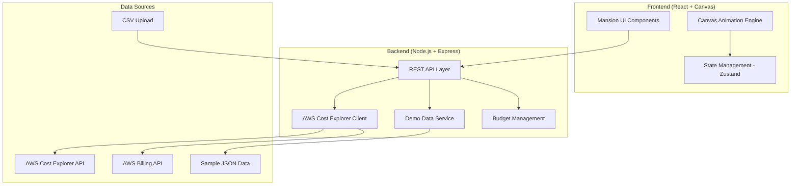

# Design Document

## Overview

The Haunted AWS Cost Guard is a web-based dashboard application that transforms AWS billing data into an immersive haunted mansion experience. The application uses a modern React frontend with Canvas/WebGL for smooth animations, a Node.js backend for AWS integration, and supports both demo and production modes for maximum accessibility.

The core innovation lies in the visual metaphor system where AWS services become rooms in a mansion, and cost levels are represented through supernatural entities with varying intensity levels. This approach makes cost monitoring intuitive and engaging while maintaining all the analytical depth required for serious cost management.

## Architecture

### High-Level Architecture



### Technology Stack

**Frontend:**
- React 18 with TypeScript for component architecture
- Canvas API with Konva.js for smooth 2D animations and interactive mansion rooms
- Zustand for lightweight state management
- React Query for server state management and caching
- Tailwind CSS for styling and responsive design
- Framer Motion for UI transitions and micro-interactions

**Backend:**
- Node.js with Express.js for API server
- AWS SDK v3 for Cost Explorer and Billing API integration
- Multer for CSV file upload handling
- Node-cron for scheduled data refresh
- Winston for logging
- Joi for request validation

**Data & Storage:**
- In-memory caching with Redis for demo data and budget settings
- Local storage for user preferences and session data
- AWS Cost Explorer API for real-time cost data
- CSV parsing for Cost Explorer exports

## Components and Interfaces

### Frontend Components

#### Core UI Components

**MansionContainer**
- Main container managing the haunted mansion layout
- Handles room positioning and overall mansion state
- Manages zoom and pan interactions for large mansions

**Room Component**
- Individual service room representation
- Renders background, supernatural entities, and visual effects
- Handles click events for drill-down functionality
- Animates entity intensity based on cost data

**SupernaturalEntity**
- Base class for ghosts, spirits, and monsters
- Implements intensity levels (peaceful → agitated → boss monster)
- Manages particle effects, color transitions, and size scaling
- Provides smooth animations between states

**DetailPanel**
- Slide-out panel for service cost breakdown
- Contains cost graphs, regional data, and tag analysis
- Implements responsive design for mobile and desktop
- Supports data export functionality

#### Animation Engine Components

**CanvasRenderer**
- Core Canvas management and rendering loop
- Handles entity animations and visual effects
- Manages performance optimization (frame rate, culling)
- Provides smooth transitions between cost states

**EffectSystem**
- Particle effects for supernatural entities
- Environmental effects (mist, lighting, shadows)
- Warning effects for budget overruns
- Ambient animations for mansion atmosphere

### Backend API Interfaces

#### Cost Data Service

```typescript
interface CostDataService {
  // Fetch cost data from AWS or demo sources
  getCostData(params: CostQueryParams): Promise<CostData>
  
  // Get service-specific breakdown
  getServiceBreakdown(service: string, timeRange: TimeRange): Promise<ServiceCostData>
  
  // Refresh data from AWS APIs
  refreshCostData(accountId: string): Promise<void>
}

interface CostQueryParams {
  accountId?: string
  timeRange: TimeRange
  services?: string[]
  groupBy?: 'service' | 'region' | 'tag'
  demoMode: boolean
}

interface CostData {
  services: ServiceCost[]
  totalCost: number
  currency: string
  lastUpdated: Date
  budgetAlerts: BudgetAlert[]
}
```

#### Budget Management Service

```typescript
interface BudgetService {
  // Get current budget settings
  getBudgets(accountId: string): Promise<Budget[]>
  
  // Update service or account budgets
  updateBudget(budget: Budget): Promise<void>
  
  // Calculate budget utilization
  calculateUtilization(costs: CostData, budgets: Budget[]): Promise<UtilizationData>
}

interface Budget {
  id: string
  accountId: string
  service?: string // null for account-wide budget
  amount: number
  currency: string
  period: 'monthly' | 'quarterly' | 'yearly'
  alertThresholds: number[] // [50, 80, 100] for warning levels
}
```

#### AWS Integration Service

```typescript
interface AWSCostClient {
  // Authenticate and validate AWS credentials
  validateCredentials(credentials: AWSCredentials): Promise<boolean>
  
  // Fetch cost and usage data
  getCostAndUsage(params: CostExplorerParams): Promise<AWSCostResponse>
  
  // Get budget information
  getBudgets(): Promise<AWSBudgetResponse>
  
  // List available services and regions
  getAvailableServices(): Promise<string[]>
}
```

## Data Models

### Core Data Models

```typescript
// Main cost data structure
interface ServiceCost {
  service: string
  displayName: string
  totalCost: number
  currency: string
  budgetUtilization: number // 0-1+ (can exceed 1 for overruns)
  regions: RegionCost[]
  tags: TagCost[]
  dailyCosts: DailyCost[]
  trend: 'increasing' | 'decreasing' | 'stable'
}

interface RegionCost {
  region: string
  cost: number
  percentage: number
}

interface TagCost {
  key: string
  value: string
  cost: number
  percentage: number
}

// Visual representation data
interface RoomState {
  service: string
  position: { x: number, y: number }
  size: { width: number, height: number }
  entityType: 'ghost' | 'spirit' | 'monster'
  intensityLevel: number // 0-100
  effectsActive: boolean
  lastUpdated: Date
}

interface SupernaturalEntityConfig {
  type: 'peaceful_ghost' | 'agitated_spirit' | 'boss_monster'
  baseSize: number
  color: string
  animationSpeed: number
  particleCount: number
  soundEffect?: string
}
```

### Demo Data Models

```typescript
interface DemoScenario {
  id: string
  name: string
  description: string
  costData: CostData
  budgets: Budget[]
  narrative: string // Story context for the scenario
}

// Predefined scenarios
const DEMO_SCENARIOS = [
  {
    id: 'normal_usage',
    name: 'Peaceful Manor',
    description: 'All services within budget, calm supernatural activity'
  },
  {
    id: 'budget_warning',
    name: 'Restless Spirits',
    description: 'Some services approaching budget limits'
  },
  {
    id: 'cost_spike',
    name: 'Haunted Chaos',
    description: 'Multiple services over budget, boss monsters active'
  }
]
```

## Error Handling

### AWS Integration Error Handling

**Authentication Errors**
- Invalid credentials: Clear error message with retry option
- Insufficient permissions: Specific guidance on required IAM policies
- Rate limiting: Automatic retry with exponential backoff
- Network timeouts: Graceful degradation to cached data

**Data Processing Errors**
- Malformed AWS responses: Log error, use fallback data structure
- Missing cost data: Display "No data available" with refresh option
- Currency conversion issues: Default to USD with warning message

### Frontend Error Handling

**Animation Performance**
- Frame rate monitoring with automatic quality reduction
- Canvas fallback for devices with limited GPU support
- Progressive enhancement for older browsers

**User Experience Errors**
- Failed API calls: Show mansion in "maintenance mode" with ghost caretakers
- Slow data loading: Skeleton mansion with loading animations
- Network disconnection: Offline mode with last cached data

### Error Recovery Strategies

```typescript
interface ErrorRecoveryService {
  // Automatic retry with exponential backoff
  retryWithBackoff<T>(operation: () => Promise<T>, maxRetries: number): Promise<T>
  
  // Graceful degradation to demo mode
  fallbackToDemoMode(): void
  
  // Cache management for offline scenarios
  getCachedData(key: string): Promise<any>
  setCachedData(key: string, data: any, ttl: number): Promise<void>
}
```

## Testing Strategy

### Frontend Testing

**Unit Tests (Jest + React Testing Library)**
- Component rendering and prop handling
- State management logic (Zustand stores)
- Utility functions for cost calculations
- Animation engine core functions

**Integration Tests**
- API integration with mock backends
- Canvas rendering with test scenarios
- User interaction flows (room clicks, panel navigation)
- Responsive design across device sizes

**Visual Regression Tests (Playwright)**
- Mansion layout consistency
- Animation state transitions
- Cross-browser compatibility
- Performance benchmarks

### Backend Testing

**Unit Tests (Jest)**
- AWS SDK integration with mocked responses
- Cost calculation algorithms
- Budget utilization logic
- Data transformation functions

**Integration Tests**
- End-to-end API workflows
- AWS service integration (with test accounts)
- CSV upload and parsing
- Demo data generation

**Load Testing (Artillery)**
- Concurrent user scenarios
- API response times under load
- Memory usage during data processing
- Animation performance with large datasets

### Test Data Strategy

**Demo Data Generation**
- Realistic AWS cost patterns based on common usage scenarios
- Edge cases (zero costs, extreme overruns, missing data)
- Multiple account sizes (startup, enterprise, multi-region)
- Seasonal variations and cost spikes

**AWS Test Environment**
- Dedicated test AWS account with controlled spending
- Automated cost data generation for consistent testing
- Budget scenarios for validation
- Regional and tag-based test data

### Performance Testing

**Frontend Performance**
- Canvas rendering benchmarks (60fps target)
- Memory usage monitoring during long sessions
- Bundle size optimization
- Lazy loading for large mansion layouts

**Backend Performance**
- AWS API response time monitoring
- Database query optimization
- Caching effectiveness measurement
- Concurrent request handling

### Accessibility Testing

**Visual Accessibility**
- Color contrast for supernatural entities (WCAG 2.1 AA)
- Alternative text for visual elements
- Keyboard navigation for all interactive elements
- Screen reader compatibility for cost data

**Cognitive Accessibility**
- Clear visual hierarchy in mansion layout
- Consistent interaction patterns
- Progressive disclosure of complex data
- Help tooltips and onboarding guidance